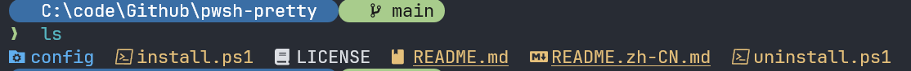

<div align="center">

# ✨ pwsh-pretty

**Turn a bland PowerShell 7 into a beautiful, productive shell — in one command.**

Minimal prompt · icon-rich `ls` · history autosuggestions · optional fzf / bat / mdcat / zoxide / fastfetch.
Built for **Windows + PowerShell 7**, friendly to **restricted networks** (scoop-based, proxy supported).

**English** | [简体中文](./README.zh-CN.md)


</div>

---

## 📸 Preview



The path sits in a rounded, colored capsule so it never blends into the previous command's output. The arrow turns **green on success**, **red on failure**. `ls` shows colored Nerd Font icons, directories first.

## 🌟 Features

- 🎯 **Minimal two-line prompt** — path capsule + Git status; arrow colored by exit code
- 🎨 **Icon-rich `ls`** — via [eza](https://github.com/eza-community/eza), with `ll` / `la` / `lt`
- ⌨️ **History autosuggestions** — inline gray hint, press `→` to accept
- 🈶 **UTF-8 by default** — fixes garbled non-ASCII filenames & icons
- 🧰 **Optional power tools** — fzf, bat, mdcat, zoxide, fastfetch (asked during install)
- 🧩 **Modular config** — profile split into `profile.d/` fragments; drop a file to add a feature
- ↩️ **Fully reversible** — backs up your config; `uninstall.ps1` restores everything

## 🚀 Install

Run in **PowerShell 7**:

```powershell
# One-liner (recommended)
irm https://raw.githubusercontent.com/Xynrin/pwsh-pretty/main/bootstrap.ps1 | iex
```

Behind a proxy:
```powershell
$env:PWSH_PRETTY_PROXY='http://127.0.0.1:7897'; irm https://raw.githubusercontent.com/Xynrin/pwsh-pretty/main/bootstrap.ps1 | iex
```

Or clone and run:
```powershell
git clone https://github.com/Xynrin/pwsh-pretty.git
cd pwsh-pretty
.\install.ps1          # interactive; -All installs everything, -CoreOnly skips extras
```

Then **fully close and reopen Windows Terminal**.

> First run may need: `Set-ExecutionPolicy RemoteSigned -Scope CurrentUser`

## 🧹 Uninstall

```powershell
.\uninstall.ps1                # restore config, keep tools
.\uninstall.ps1 -RemoveTools   # also remove installed tools
```

## 📚 Documentation

- **[Enhanced tools](./docs/tools.md)** — fzf / bat / mdcat / zoxide / fastfetch usage
- **[Customization](./docs/customization.md)** — colors, themes, `ls` aliases, prediction
- **[Troubleshooting](./docs/troubleshooting.md)** — icons, encoding, proxy, FAQ

## 🤝 Contributing

Issues & PRs welcome. Please include your `$PSVersionTable.PSVersion`, whether you used `-Proxy`, and the exact error text. See [troubleshooting](./docs/troubleshooting.md).

## 📄 License

[MIT](./LICENSE) © Xynrin
